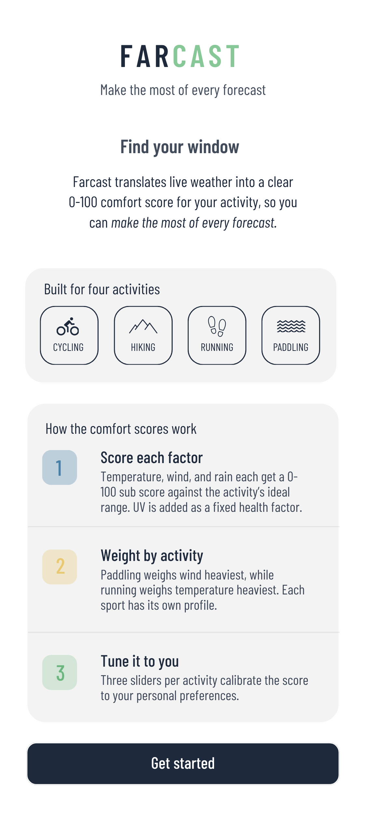
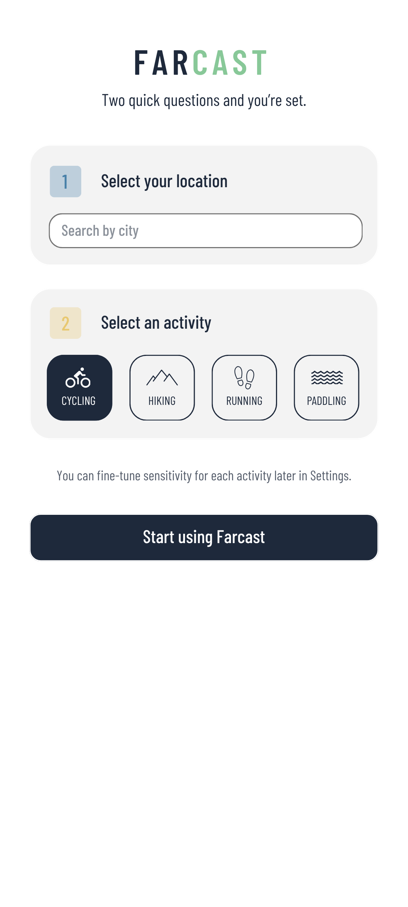
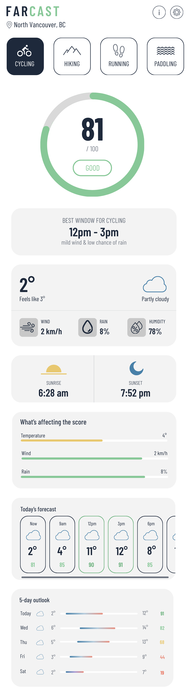
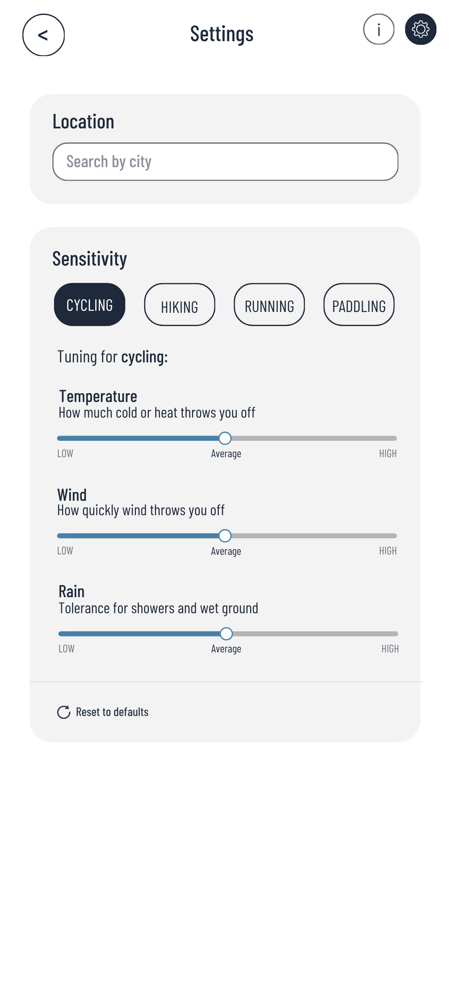
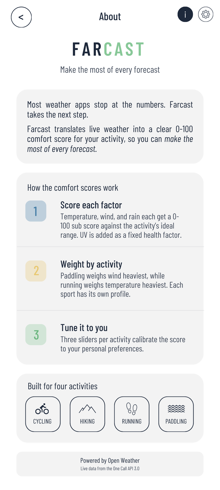

# Farcast — Project Planning Documentation

---

## 1. Project Summary

### What is Farcast?

Farcast is a mobile-first web app that translates live weather data into a clear, activity-specific comfort score. Instead of showing raw numbers and leaving interpretation to the user, Farcast answers one question directly: **when is my window of opportunity?**

Built for cyclists, hikers, runners, and paddlers.

### The problem it solves

Every existing weather app shows the same data: temperature, wind speed, rain chance, UV index. But a cyclist planning a morning ride and a hiker planning an afternoon trail have completely different thresholds for what makes conditions acceptable. A headwind that ruins a cycling trip might not bother a hiker at all. A 60% chance of rain might be a dealbreaker for a paddler but fine for a runner in a rain jacket.

Right now users have to look at the numbers and figure out themselves whether conditions are good for what they're doing. Farcast does that thinking for them. It scores the weather 0-100 based on the selected activity, weighs each factor (wind, rain, temperature) by how much it matters for that sport, and lets users adjust the sensitivity to match their own preferences.

### Target user

Outdoor enthusiasts including cyclists, hikers, runners, and paddlers, who want a quick answer to whether conditions are good before they head out.

---

## 2. UI Mockups

All screens were designed in Canva at 360×800px following an 8-point grid spacing system. The app is mobile-first and responsive.

### Screen 1 - Welcome



The first screen users see when they open the app. It explains what Farcast does, walks through how the comfort score works in three steps, shows the four supported activities, and has a button to get started.

---

### Screen 2 - Onboarding



A simple setup screen that asks the user two things before they can use the app:

1. Their location, and
2. What activity they do.

There is no account needed. Everything is saved on the device.

---

### Screen 3 - Home (scrollable)



The main screen. Fixed top navigation shows the brand, location, and navigation icons. The activity switcher sits just below. The rest of the screen scrolls and shows:

- Circular comfort score gauge (0–100) with activity label and status tag
- Best window card showing the optimal time range for the selected activity
- Current conditions (temperature, feels like, wind, rain, humidity, weather description)
- Sunrise and sunset times
- "What's affecting the score" — horizontal bars showing how each factor (temperature, wind, rain, UV) is contributing to the score
- Today's forecast — 3-hour interval scroll showing weather icon, temperature, and per-interval comfort score for the current day
- 5-day outlook — daily forecast with temperature range bars and comfort score per day

---

### Screen 4 - Settings



Two sections. The first lets users change their location by picking from a list of preset locations. The second lets users tune their sensitivity for each activity using three sliders (temperature, wind, and rain.) Each slider has a description of what it controls. Users can reset sliders back to defaults.

---

### Screen 5 - About



The about screen explains the app's purpose and scoring methodology in plain language. It repeats the three-step scoring explanation from the welcome screen, lists the four supported activities, and credits OpenWeather as the data source.

---

## 3. Database Schema

Farcast has no backend and no database. All user data is stored in the browser using localStorage.

### localStorage keys

| Key | Type | Description |
|---|---|---|
| `farcast_location` | Object | User's saved location |
| `farcast_active_activity` | String | Currently selected activity |
| `farcast_sensitivity` | Object | Sensitivity settings per activity |
| `farcast_last_fetch` | String | Timestamp of last API call |
| `farcast_weather_data` | Object | The last weather response from OpenWeather |

### Data shapes

#### `farcast_location`

```json
{
  "city": "North Vancouver",
  "region": "BC",
  "country": "CA",
  "lat": 49.3198,
  "lon": -123.0724
}
```

#### `farcast_active_activity`

```json
"cycling"
```
Valid values: `"cycling"` | `"hiking"` | `"running"` | `"paddling"`

#### `farcast_sensitivity`

```json
{
  "cycling": {
    "temperature": 3,
    "wind": 4,
    "rain": 3
  },
  "hiking": {
    "temperature": 2,
    "wind": 2,
    "rain": 3
  },
  "running": {
    "temperature": 3,
    "wind": 2,
    "rain": 4
  },
  "paddling": {
    "temperature": 2,
    "wind": 5,
    "rain": 3
  }
}
```
Each value is a number from 1–5 where 1 = low sensitivity and 5 = high sensitivity.

#### `farcast_weather_data`

```json
{
  "fetchedAt": "2025-04-24T09:00:00Z",
  "lat": 49.3198,
  "lon": -123.0724,
  "current": { ... },
  "forecast": [ ... ]
}
```
`current` comes from the `/data/2.5/weather` endpoint. `forecast` comes from `/data/2.5/forecast`. The data is kept for 30 minutes before fetching again to avoid redundant API calls.

---

## 4. API Endpoints
 
Farcast uses the OpenWeather free API. There is no custom backend. The app calls OpenWeather directly from the browser.
 
**Base URL:** `https://api.openweathermap.org/data/2.5`
 
The API key is stored in a `.env` file as `VITE_OPENWEATHER_KEY` and never shared publicly.
 
---
 
### Endpoint 1 - Current weather
 
```
GET /data/2.5/weather
```
 
Fetches current conditions for a given location.
 
| Parameter | Type | Required | Description |
|---|---|---|---|
| `lat` | Number | Yes | Latitude |
| `lon` | Number | Yes | Longitude |
| `units` | String | Yes | Set to `metric` for Celsius / km/h |
| `appid` | String | Yes | API key (stored in `.env` as `VITE_OPENWEATHER_KEY`) |
 
**Example:**
 
```
GET https://api.openweathermap.org/data/2.5/weather
  ?lat=49.3198
  &lon=-123.0724
  &units=metric
  &appid=YOUR_API_KEY
```
 
---
 
### Endpoint 2 - 5-day forecast
 
```
GET /data/2.5/forecast
```
 
Fetches a 3-hour interval forecast for 5 days (40 entries total).
 
| Parameter | Type | Required | Description |
|---|---|---|---|
| `lat` | Number | Yes | Latitude |
| `lon` | Number | Yes | Longitude |
| `units` | String | Yes | `metric` for Celsius / km/h |
| `appid` | String | Yes | API key (stored in `.env` as `VITE_OPENWEATHER_KEY`) |
 
**Example:**
```
GET https://api.openweathermap.org/data/2.5/forecast
  ?lat=49.3198
  &lon=-123.0724
  &units=metric
  &appid=YOUR_API_KEY
```
 
---
 
### Data Validation
 
| Field | Rule |
|---|---|
| `lat` | Number, -90 to 90 |
| `lon` | Number, -180 to 180 |
| `temp` | Number, expected range -60 to 60 for metric |
| `wind.speed` | Number >= 0 |
| `pop` | Number, 0 to 1 (chance of rain as a decimal) |
| `dt` | Unix timestamp (seconds since Jan 1 1970), must be a positive number |
| Activity | Must be one of: `cycling`, `hiking`, `running`, `paddling` |
| Sensitivity value | Whole number between 1 and 5|
 
---

## 5. JSON Contracts
 
These are the exact shapes of the data that comes back from the OpenWeather API. The app reads these fields to display conditions and calculate the comfort score.
 
### Current weather (from `GET /data/2.5/weather`)
 
```json
{
  "dt": 1745481600,
  "main": {
    "temp": 12.4,
    "feels_like": 10.8,
    "humidity": 78
  },
  "wind": {
    "speed": 2.1,
    "deg": 220
  },
  "weather": [
    {
      "id": 803,
      "main": "Clouds",
      "description": "broken clouds",
      "icon": "04d"
    }
  ],
  "sys": {
    "sunrise": 1745460974,
    "sunset": 1745511745
  }
}
```
 
| Field | Description |
|---|---|
| `dt` | Time of the reading (seconds since Jan 1 1970) |
| `main.temp` | Current temperature in degrees celsius |
| `main.feels_like` | Feels like temperature in degrees celsius |
| `main.humidity` | Humidity as a percentage |
| `wind.speed` | Wind speed in km/h |
| `wind.deg` | Wind direction in degrees |
| `weather[0].description` | Plain text weather description |
| `weather[0].icon` | Icon code used to display a weather icon |
| `sys.sunrise` | Sunrise time (seconds since Jan 1 1970) |
| `sys.sunset` | Sunset time (seconds since Jan 1 1970) |
 
---
 
### 5-day forecast (from `GET /data/2.5/forecast`)
 
The response contains a `list` array. Each entry covers a 3-hour window.
 
```json
{
  "dt": 1745485200,
  "main": {
    "temp": 13.1,
    "feels_like": 11.5,
    "humidity": 76
  },
  "wind": {
    "speed": 3.4,
    "deg": 215
  },
  "pop": 0.08,
  "weather": [
    {
      "id": 801,
      "main": "Clouds",
      "description": "few clouds",
      "icon": "02d"
    }
  ],
  "dt_txt": "2025-04-24 09:00:00"
}
```
 
| Field | Description |
|---|---|
| `dt` | Time of this forecast entry (seconds since Jan 1 1970) |
| `main.temp` | Forecast temperature in degrees celsius |
| `main.feels_like` | Forecast feels like temperature in degrees celsius |
| `main.humidity` | Forecast humidity as a percentage |
| `wind.speed` | Forecast wind speed in km/h |
| `pop` | Probability of rain — a number from 0 to 1 (e.g. 0.08 = 8%) |
| `weather[0].description` | Plain text weather description |
| `weather[0].icon` | Icon code used to display a weather icon |
| `dt_txt` | Human readable date and time for this entry |
 
---

## 6. Data Workflows
 
### Workflow 1 - First launch and onboarding
 
```
User opens app
  - App checks localStorage for a saved location
  - No location found -> show Onboarding screen
    - User picks a location from the list
    - Location saved to farcast_location in localStorage
    - User picks an activity (e.g. cycling)
    - Activity saved to farcast_active_activity in localStorage
    - User taps "Start using Farcast"
    - App goes to Home screen
    - App checks farcast_weather_data -> nothing found
    - App calls OpenWeather for current conditions and 5-day forecast
    - Both responses saved to farcast_weather_data with a timestamp
    - Comfort score is calculated from the weather data
    - Home screen renders with score, breakdown, today's forecast, and 5-day outlook
```
 
---
 
### Workflow 2 - How the comfort score is calculated
 
```
Input:
  - Current weather data (temp, wind speed, rain chance)
  - Selected activity (e.g. cycling)
  - User sensitivity settings (e.g. wind: 4, rain: 3, temp: 3)
 
Step 1 - Score each weather factor from 0 to 100
 
    Each raw weather value is converted into a score from 0 to 100. If the value is inside the ideal range the score is 100.
    The further outside the ideal range it gets, the lower the score. At the avoid threshold the score hits 0 (please refer to the scoring reference below.)
 
  The formula is:
    score = 100 - ((actual value - ideal max) / (avoid threshold - ideal max)) x 100
 
  Example for cycling wind at 28 km/h:
    score = 100 - ((28 - 15) / (40 - 15)) x 100
    score = 100 - (13 / 25) x 100
    score = 100 - 52
    score = 48
 
  If the value is inside the ideal range the score is 100. If the value is at or past the avoid threshold the score is 0.
 
  Example for cycling with these conditions:
    - Temperature 12°C  -> score 90  (inside ideal range 8–22°C, small penalty applied)
    - Wind speed 2 km/h -> score 95  (well inside ideal range 0–15 km/h)
    - Rain chance 8%    -> score 92  (inside ideal range 0–15%)
 
Step 2 - Apply base activity weights
 
  Each activity has built-in weights that say how much each factor
  matters. These three numbers always add up to 1.0 (100%).
 
    cycling:  { temperature: 0.25, wind: 0.45, rain: 0.30 }
    hiking:   { temperature: 0.30, wind: 0.25, rain: 0.45 }
    running:  { temperature: 0.40, wind: 0.25, rain: 0.35 }
    paddling: { temperature: 0.20, wind: 0.55, rain: 0.25 }
 
  For cycling this means wind matters most (45%), rain is second
  (30%), and temperature matters least (25%).
 
Step 3 - Adjust weights using the user's sensitivity sliders
 
  The slider values (1-5) are converted into multipliers that
  push each weight up or down:
 
    slider 1 -> x 0.6  (that factor matters less than default)
    slider 2 -> x 0.8
    slider 3 -> x 1.0  (no change — this is the default)
    slider 4 -> x 1.2
    slider 5 -> x 1.4  (that factor matters more than default)
 
  Example — user sets wind sensitivity to 4, others stay at 3:
    wind:        0.45 x 1.2 = 0.54
    rain:        0.30 x 1.0 = 0.30
    temperature: 0.25 x 1.0 = 0.25
    total:       1.09
 
  After adjusting, the weights no longer add up to 1.0 so they
  are re-normalised by dividing each by the new total:
    wind:        0.54 / 1.09 = 0.495
    rain:        0.30 / 1.09 = 0.275
    temperature: 0.25 / 1.09 = 0.229
    total:       1.00
 
  The proportions are still the same — wind is still the biggest
  factor — they have just been scaled back into the right range.
 
Step 4 - Multiply each score by its adjusted weight and add them up
 
  Using the example above with default sliders (all at 3):
 
    wind contribution        = 95 x 0.45 = 42.75
    rain contribution        = 92 x 0.30 = 27.60
    temperature contribution = 90 x 0.25 = 22.50
 
    rawScore = 42.75 + 27.60 + 22.50 = 92.85
 
Step 5 - Round the score and keep it between 0 and 100
 
  - If the score is below 0, set it to 0
  - If the score is above 100, set it to 100
  - Round to the nearest whole number
 
  finalScore = 93
 
Output:
  {
    score: 93,
    label: "Optimal",
    breakdown: {
      temperature: { score: 90, value: "12°C" },
      wind:        { score: 95, value: "2 km/h" },
      rain:        { score: 92, value: "8%"    }
    }
  }
```
 
---
 
### Workflow 3 - Coming back to the app and switching activity
 
```
User opens app
  - App finds saved location -> skip onboarding
  - App checks farcast_weather_data
    - Less than 30 minutes old -> use saved data, skip API call
    - More than 30 minutes old -> fetch fresh data from OpenWeather
  - Home screen loads with the last used activity (e.g. cycling)
  - User taps "Hiking" in the activity switcher
    - Active activity updated to "hiking" in localStorage
    - Comfort score recalculates using hiking weights
    - Score, breakdown, forecast, and 5-day outlook all update
    - No new API call needed — same weather data, different weights
```
 
---
 
## 7. Scoring Reference
 
These are the ideal ranges and avoid thresholds used to convert raw weather values into factor scores. The score decreases steadily from 100 at the edge of the ideal range to 0 at the avoid threshold.
 
### Score colour ranges
 
| Score | Label | Hex |
|---|---|---|
| 90–100 | Optimal | `#88C898` |
| 70–89 | Good | `#B8DDB8` |
| 45–69 | Fair | `#E8C870` |
| 20–44 | Poor | `#E89080` |
| 0–19 | Avoid | `#B84030` |
 
### Temperature (°C)
 
| Activity | Score 100 | Score 0 |
|---|---|---|
| Cycling | 8° – 22° | Below 2° or above 32° |
| Hiking | 8° – 20° | Below 0° or above 30° |
| Running | 5° – 16° | Below 0° or above 28° |
| Paddling | 12° – 24° | Below 5° or above 36° |
 
### Wind speed (km/h)
 
| Activity | Score 100 | Score 0 |
|---|---|---|
| Cycling | 0 – 15 | 40+ |
| Hiking | 0 – 20 | 50+ |
| Running | 0 – 15 | 42+ |
| Paddling | 0 – 10 | 30+ |
 
### Rain chance (%)
 
| Activity | Score 100 | Score 0 |
|---|---|---|
| Cycling | 0 – 15% | 55%+ |
| Hiking | 0 – 20% | 65%+ |
| Running | 0 – 20% | 60%+ |
| Paddling | 0 – 25% | 70%+ |
 
Every value between Score 100 and Score 0 is calculated automatically. The score drops at a steady rate the further outside the ideal range conditions get. No manual thresholds are needed for the middle ranges.
 
---

## 6. Out of Scope Features & Assumptions

### Out of scope for initial release

| Feature | Why it was left out |
|---|---|
| Per-hour forecast | The free API only gives data every 3 hours |
| 7-day forecast | The free API only covers 5 days |
| Push notifications | Not supported as a standard web app |
| Adding custom activities | The four built-in ones cover the main use cases |
| User accounts | Not needed. Everything saves locally on the device |
| Dark mode | Can be added later on |
| Multiple saved locations | Only one active location in v1 |
| Location search | Using a preset list of locations for v1 |

### Assumptions

- Users have a stable internet connection.
- The OpenWeather free tier provides sufficient data for this project.
- The app is designed for mobile-first use at 360×800px but is responsive to wider viewports
- All user data is stored client-side in localStorage
- The comfort score algorithm uses fixed base weights per activity that were determined during design. These can only be adjusted by the users through the sensitivity sliders.